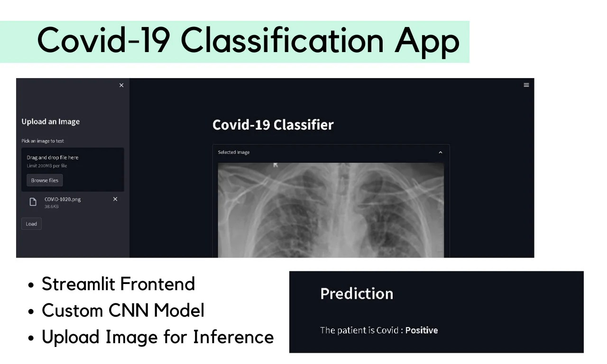

# Covid-19-Classification-Project
A binary covid classification project for X-ray images.




## Setup
### 1. Clone the repository first using this command
```
git clone https://github.com/ishangala16/Covid-19-Classification-Project.git
```

### 2. Install dependencies 
```
pip install -r requirements.txt
```

## How to run

Run in terminal
```
streamlit run main.py
```

Open browser and type
```
http://localhost:5000/
```

Upload an X-ray image and click submit to classify


